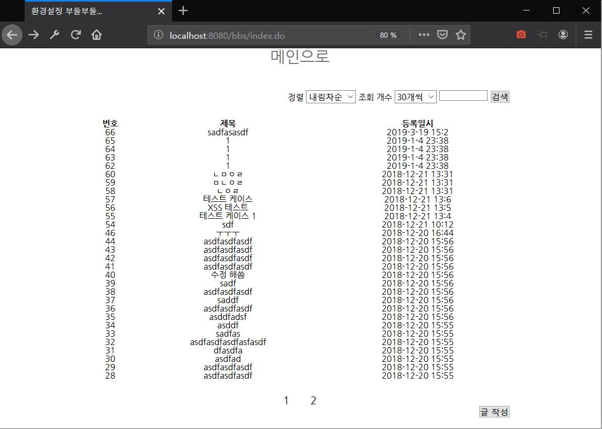

# 스프링 MVC 게시판

****
## PREVIEW
<br>


### 2018-12-25 ~ 2019.xx.xx 까지

##### 한국산업기술대학교 현장실습에서 인턴으로 활동시 <br> 레벨테스트로 봣던 SpringMVC 게시판 프로젝트입니다. 

****

## 프로젝트 요약
* **작업기간 : 2일**
* **프로젝트 스팩**
    - 어플리케이션 프레임워크 : Spring 4
      + 기타 프레임 워크 : MyBatis..      

    - 데이터베이스 : MySQL 5.X

* **요구 사항**
    - 게시판 프로젝트
      + 글 작성 시간을 기준으로 [오름차순/내림차순] 정렬 지원
      + 게시글 보기 [10/30/50] 개씩 선택해서 보기 지원
      + 게시판 페이징 기능 지원
      + 게시글 제목을 기준으로 검색기능 지원
      + 게시글 목록은 전부 AJAX를 통해 렌더링해야함


## DB 세팅 

**1. DB DUMP** 

cmd 접속 후

```
 mysql -u root -p bbs < '(프로젝트경로)/PROJECT_DOC/DB_DUMP/BACKUP_BBS_2019_05_02.sql'
```


**2. 유저 생성**
루트로 MySQL 접속 후

```
 GRANT ALL PRIVILEGES ON bbs.* TO sight@localhost IDENTIFIED BY 'bksul40'
```

